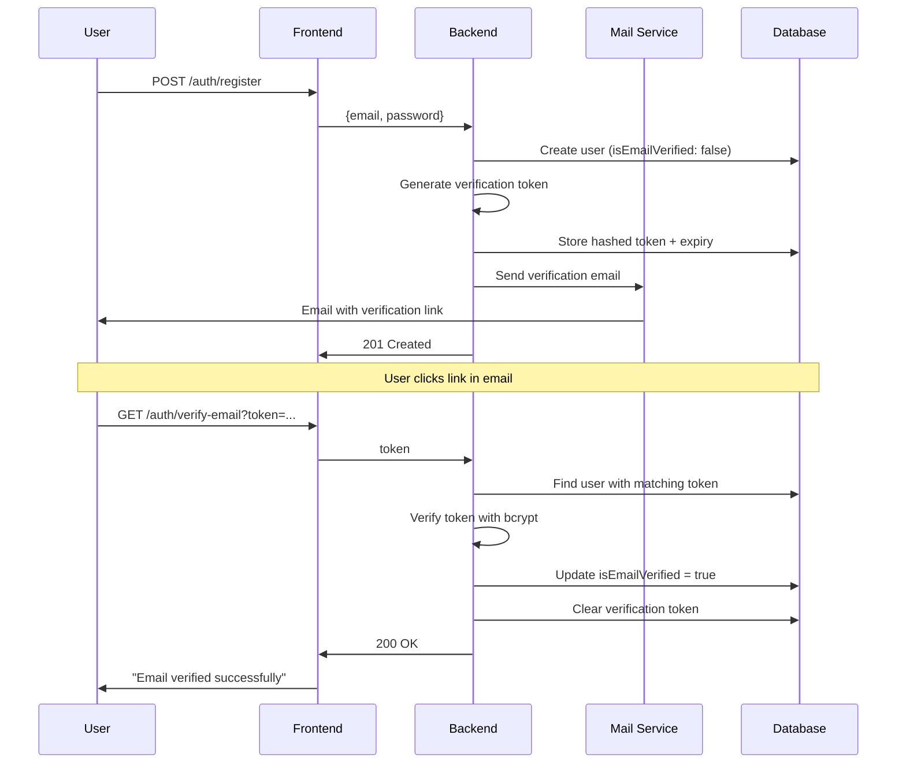

# Email Verification API Documentation

## Overview

API xác thực email người dùng sau khi đăng ký tài khoản. Email xác thực được gửi tự động sau khi đăng ký và có thể được gửi lại nếu cần.

**Base URL**: `/auth`

---

## Endpoints

### 1. Verify Email (Xác thực email)

Xác thực email của người dùng thông qua token được gửi qua email. Token được hash và lưu trữ an toàn trong database.

**Endpoint**: `GET /auth/verify-email`

**Authentication**: Không yêu cầu (Public)

#### Query Parameters

| Parameter | Type   | Required | Description                            |
| --------- | ------ | -------- | -------------------------------------- |
| token     | string | Yes      | Token xác thực (64 ký tự hex) từ email |

#### Response

**Success (200 OK)**

```json
{
  "message": "Email verified successfully. You can now log in."
}
```

**Error Responses**

- **400 Bad Request**: Token không hợp lệ hoặc thiếu

```json
{
  "statusCode": 400,
  "message": "Invalid or expired verification token",
  "error": "Bad Request"
}
```

#### URL Example

```
http://localhost:3000/auth/verify-email?token=a1b2c3d4e5f6...
```

#### cURL Example

```bash
curl -X GET "http://localhost:3000/auth/verify-email?token=YOUR_VERIFICATION_TOKEN"
```

#### Notes

- Token được tạo bằng `crypto.randomBytes(32).toString('hex')` (64 ký tự)
- Token được hash bằng bcrypt trước khi lưu vào database
- Token có hiệu lực 48 giờ
- Sau khi xác thực thành công, token sẽ bị xóa khỏi database
- Email đã xác thực không thể xác thực lại

---

### 2. Resend Verification Email (Gửi lại email xác thực)

Gửi lại email xác thực cho người dùng chưa xác thực email. Tạo token mới và gửi email xác thực.

**Endpoint**: `POST /auth/resend-verification`

**Rate Limit**: 3 requests / 1 giờ

**Authentication**: Không yêu cầu (Public)

#### Request Body

```json
{
  "email": "user@example.com"
}
```

| Field | Type   | Required | Validation         | Description                |
| ----- | ------ | -------- | ------------------ | -------------------------- |
| email | string | Yes      | Valid email format | Email cần gửi lại xác thực |

#### Response

**Success (200 OK)**

```json
{
  "message": "Verification email sent successfully"
}
```

**Error Responses**

- **400 Bad Request**: Email không hợp lệ hoặc user không tồn tại

```json
{
  "statusCode": 400,
  "message": "User not found",
  "error": "Bad Request"
}
```

- **400 Bad Request**: Email đã được xác thực

```json
{
  "statusCode": 400,
  "message": "Email is already verified",
  "error": "Bad Request"
}
```

- **429 Too Many Requests**: Vượt quá rate limit

```json
{
  "statusCode": 429,
  "message": "Too many requests",
  "error": "Too Many Requests"
}
```

#### cURL Example

```bash
curl -X POST http://localhost:3000/auth/resend-verification \
  -H "Content-Type: application/json" \
  -d '{
    "email": "user@example.com"
  }'
```

#### Notes

- Tạo token mới mỗi lần gửi lại (token cũ bị thay thế)
- Token mới có hiệu lực 48 giờ
- Rate limit ngăn spam email
- Nếu gửi email thất bại, không ném lỗi nhưng sẽ log error

---

## Email Template

### Verification Email Content

Email xác thực được gửi tự động từ `MailService` với nội dung:

**Subject**: "Verify your email address"

**Body** (HTML):

```html
<p>Thank you for registering!</p>
<p>Please click the link below to verify your email address:</p>
<a href="{FRONTEND_URL}/auth/verify-email?token={TOKEN}">Verify Email</a>
<p>This link will expire in 48 hours.</p>
```

**Variables**:

- `{FRONTEND_URL}`: Từ environment variable `FRONTEND_URL`
- `{TOKEN}`: Token xác thực 64 ký tự hex

---

## Security Features

### Token Generation

```typescript
// Generate random 32-byte token (64 hex characters)
const verificationToken = crypto.randomBytes(32).toString('hex');

// Hash token before storing in database
const hashedToken = await bcrypt.hash(verificationToken, 10);
```

### Token Storage

- **Plain token**: Gửi qua email (1 lần duy nhất)
- **Hashed token**: Lưu trong database
- **Expiry**: 48 giờ từ thời điểm tạo

### Verification Process

1. User nhận email với plain token
2. User click link verification
3. Backend nhận plain token từ query parameter
4. So sánh plain token với hashed token trong database bằng bcrypt
5. Nếu khớp và chưa hết hạn → xác thực thành công
6. Xóa token khỏi database

---

## Integration Flow

### Registration → Verification Flow



---

## Common Errors

### Token Expired

**Scenario**: User click link sau 48 giờ

**Response**:

```json
{
  "statusCode": 400,
  "message": "Invalid or expired verification token",
  "error": "Bad Request"
}
```

**Solution**: Sử dụng endpoint `POST /auth/resend-verification`

### Email Already Verified

**Scenario**: User đã verify nhưng click link lần nữa

**Response**:

```json
{
  "statusCode": 400,
  "message": "Email is already verified",
  "error": "Bad Request"
}
```

**Solution**: User có thể đăng nhập ngay

### User Not Found

**Scenario**: Gửi lại verification cho email không tồn tại

**Response**:

```json
{
  "statusCode": 400,
  "message": "User not found",
  "error": "Bad Request"
}
```

---

## Best Practices

### For Frontend Developers

1. **Handle verification link**:

   ```typescript
   // Extract token from URL
   const params = new URLSearchParams(window.location.search);
   const token = params.get('token');

   // Call verification API
   const response = await fetch(`/auth/verify-email?token=${token}`);
   ```

2. **Show appropriate messages**:
   - Loading state while verifying
   - Success message with login redirect
   - Error message with resend option

3. **Resend verification**:
   ```typescript
   const resendVerification = async (email: string) => {
     await fetch('/auth/resend-verification', {
       method: 'POST',
       headers: { 'Content-Type': 'application/json' },
       body: JSON.stringify({ email }),
     });
   };
   ```

### For Backend Developers

1. **Email service error handling**: Log errors nhưng không fail request
2. **Token expiry**: Tự động cleanup expired tokens (sử dụng cleanup service)
3. **Rate limiting**: Ngăn spam verification emails
4. **Secure token generation**: Sử dụng crypto.randomBytes (không dùng Math.random())

---

## Related APIs

- [Authentication](./authentication.md) - Đăng ký và đăng nhập
- [Password Reset](./password-reset.md) - Quên mật khẩu
- [Google OAuth](./google-oauth.md) - Đăng nhập Google (tự động verified)
