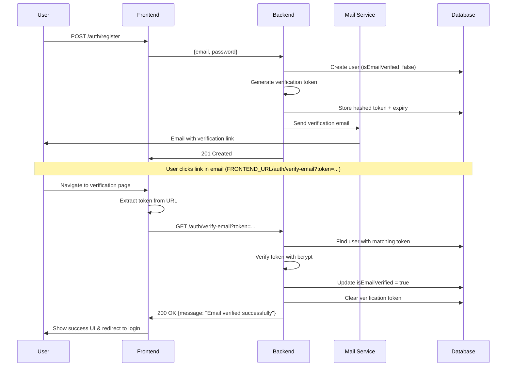

# Email Verification API Documentation

## Overview

API xác thực email người dùng sau khi đăng ký tài khoản. Email xác thực được gửi tự động sau khi đăng ký và có thể được gửi lại nếu cần.

**Base URL**: `/auth`

---

## Endpoints

### 1. Verify Email (Xác thực email)

Xác thực email của người dùng thông qua token được gửi qua email. Token được hash và lưu trữ an toàn trong database.

**Endpoint**: `GET /auth/verify-email`

**Authentication**: Không yêu cầu (Public)

#### Query Parameters

| Parameter | Type   | Required | Description                            |
| --------- | ------ | -------- | -------------------------------------- |
| token     | string | Yes      | Token xác thực (64 ký tự hex) từ email |

#### Response

**Success (200 OK)**

```json
{
  "message": "Email verified successfully. You can now log in."
}
```

**Error Responses**

- **400 Bad Request**: Token không hợp lệ hoặc thiếu

```json
{
  "statusCode": 400,
  "message": "Invalid or expired verification token",
  "error": "Bad Request"
}
```

#### URL Example

```
http://localhost:3000/auth/verify-email?token=a1b2c3d4e5f6...
```

#### cURL Example

```bash
curl -X GET "http://localhost:3000/auth/verify-email?token=YOUR_VERIFICATION_TOKEN"
```

#### Notes

- Token được tạo bằng `crypto.randomBytes(32).toString('hex')` (64 ký tự)
- Token được hash bằng bcrypt trước khi lưu vào database
- Token có hiệu lực 48 giờ
- Sau khi xác thực thành công, token sẽ bị xóa khỏi database
- Email đã xác thực không thể xác thực lại

---

### 2. Resend Verification Email (Gửi lại email xác thực)

Gửi lại email xác thực cho người dùng chưa xác thực email. Tạo token mới và gửi email xác thực.

**Endpoint**: `POST /auth/resend-verification`

**Rate Limit**: 3 requests / 1 giờ

**Authentication**: Không yêu cầu (Public)

#### Request Body

```json
{
  "email": "user@example.com"
}
```

| Field | Type   | Required | Validation         | Description                |
| ----- | ------ | -------- | ------------------ | -------------------------- |
| email | string | Yes      | Valid email format | Email cần gửi lại xác thực |

#### Response

**Success (200 OK)**

```json
{
  "message": "Verification email sent successfully"
}
```

**Error Responses**

- **400 Bad Request**: Email không hợp lệ hoặc user không tồn tại

```json
{
  "statusCode": 400,
  "message": "User not found",
  "error": "Bad Request"
}
```

- **400 Bad Request**: Email đã được xác thực

```json
{
  "statusCode": 400,
  "message": "Email is already verified",
  "error": "Bad Request"
}
```

- **429 Too Many Requests**: Vượt quá rate limit

```json
{
  "statusCode": 429,
  "message": "Too many requests",
  "error": "Too Many Requests"
}
```

#### cURL Example

```bash
curl -X POST http://localhost:3000/auth/resend-verification \
  -H "Content-Type: application/json" \
  -d '{
    "email": "user@example.com"
  }'
```

#### Notes

- Tạo token mới mỗi lần gửi lại (token cũ bị thay thế)
- Token mới có hiệu lực 48 giờ
- Rate limit ngăn spam email
- Nếu gửi email thất bại, không ném lỗi nhưng sẽ log error

---

## Email Template

### Verification Email Content

Email xác thực được gửi tự động từ `MailService` với nội dung:

**Subject**: "Verify Your Email Address"

**Body** (HTML):

Email có giao diện đẹp với styling inline CSS, bao gồm:
- Header "Email Verification" màu xanh (#2563eb)
- Nội dung chào mừng và hướng dẫn
- Button "Verify Email Address" màu xanh
- Link text dạng plain để copy/paste
- Warning box cảnh báo link hết hạn sau 48 giờ

**Link trong email**:

```
{FRONTEND_URL}/auth/verify-email?token={TOKEN}
```

**Variables**:

- `{FRONTEND_URL}`: Từ environment variable `FRONTEND_URL` (ví dụ: `http://localhost:3001`)
- `{TOKEN}`: Token xác thực 64 ký tự hex

**Note**: Link trỏ đến **frontend application**, không phải backend API. Frontend page sẽ extract token và gọi backend API để xác thực.

---

## Security Features

### Token Generation

```typescript
// Generate random 32-byte token (64 hex characters)
const verificationToken = crypto.randomBytes(32).toString('hex');

// Hash token before storing in database
const hashedToken = await bcrypt.hash(verificationToken, 10);
```

### Token Storage

- **Plain token**: Gửi qua email (1 lần duy nhất)
- **Hashed token**: Lưu trong database
- **Expiry**: 48 giờ từ thời điểm tạo

### Verification Process

1. User nhận email với plain token
2. User click link verification
3. Backend nhận plain token từ query parameter
4. So sánh plain token với hashed token trong database bằng bcrypt
5. Nếu khớp và chưa hết hạn → xác thực thành công
6. Xóa token khỏi database

---

## Integration Flow

### Registration → Verification Flow



---

## Common Errors

### Token Expired

**Scenario**: User click link sau 48 giờ

**Response**:

```json
{
  "statusCode": 400,
  "message": "Invalid or expired verification token",
  "error": "Bad Request"
}
```

**Solution**: Sử dụng endpoint `POST /auth/resend-verification`

### Email Already Verified

**Scenario**: User đã verify nhưng click link lần nữa

**Response**:

```json
{
  "statusCode": 400,
  "message": "Email is already verified",
  "error": "Bad Request"
}
```

**Solution**: User có thể đăng nhập ngay

### User Not Found

**Scenario**: Gửi lại verification cho email không tồn tại

**Response**:

```json
{
  "statusCode": 400,
  "message": "User not found",
  "error": "Bad Request"
}
```

---

## Best Practices

### For Frontend Developers

1. **Email verification page** (`/auth/verify-email`):

   Tạo trang frontend để handle verification link từ email:

   ```typescript
   // mimkat-client/src/app/auth/verify-email/page.tsx
   import { useEffect, useState } from 'react';
   import { useRouter, useSearchParams } from 'next/navigation';
   import { useI18n } from '@/i18n/context';
   import { authService } from '@/services/auth.service';

   function VerifyEmailContent() {
     const { t } = useI18n();
     const router = useRouter();
     const searchParams = useSearchParams();
     const [status, setStatus] = useState<'loading' | 'success' | 'error'>('loading');
     const [message, setMessage] = useState('');

     useEffect(() => {
       const verifyEmail = async () => {
         const token = searchParams.get('token');

         if (!token) {
           setStatus('error');
           setMessage(t('auth.invalidToken'));
           return;
         }

         try {
           const response = await authService.verifyEmail(token);
           setStatus('success');
           setMessage(response.message || t('auth.emailVerifiedSuccessfully'));

           // Redirect to login after 3 seconds
           setTimeout(() => router.push('/auth'), 3000);
         } catch (error: any) {
           setStatus('error');
           setMessage(error.message || t('auth.verificationError'));
         }
       };

       verifyEmail();
     }, [searchParams, router, t]);

     // Render UI based on status (loading/success/error)
     return (/* UI components */);
   }
   ```

2. **API Service method**:

   ```typescript
   // mimkat-client/src/services/auth.service.ts
   async verifyEmail(token: string): Promise<VerifyEmailResponse> {
     try {
       const response = await authAxios.get<VerifyEmailResponse>(
         `/auth/verify-email?token=${token}`
       );
       return response.data;
     } catch (error) {
       if (axios.isAxiosError(error) && error.response) {
         throw new Error(error.response.data.message || 'Verification failed');
       }
       throw new Error('An unexpected error occurred');
     }
   }
   ```

3. **Show appropriate messages**:
   - **Loading state**: Spinner + "Đang xác thực email..."
   - **Success state**: Green checkmark + success message + auto-redirect to login (3 seconds)
   - **Error state**: Red X + error message + link to login + resend instruction

4. **i18n Support**:

   Sử dụng `useI18n` hook để hỗ trợ đa ngôn ngữ (tiếng Việt/English):

   ```json
   // vi.json
   {
     "auth": {
       "verifyingEmail": "Đang xác thực email...",
       "verificationSuccess": "Xác thực thành công!",
       "verificationFailed": "Xác thực thất bại",
       "invalidToken": "Token xác thực không hợp lệ",
       "emailVerifiedSuccessfully": "Email đã được xác thực thành công!",
       "redirectingToLoginShortly": "Bạn sẽ được chuyển đến trang đăng nhập trong giây lát...",
       "goToLogin": "Đến trang đăng nhập",
       "backToLoginPage": "Quay lại trang đăng nhập",
       "needResendVerification": "Cần gửi lại email xác thực? Vui lòng đăng nhập và chọn \"Gửi lại email xác thực\""
     }
   }
   ```

5. **Resend verification**:
   ```typescript
   const resendVerification = async (email: string) => {
     await fetch('/auth/resend-verification', {
       method: 'POST',
       headers: { 'Content-Type': 'application/json' },
       body: JSON.stringify({ email }),
     });
   };
   ```

**Important Notes**:
- Email link phải trỏ đến **FRONTEND_URL**, không phải backend API URL
- Frontend page extract token từ URL query parameter
- Frontend gọi backend API để verify token
- Hiển thị UI thân thiện với user (loading/success/error states)
- Auto-redirect về login page sau khi verify thành công

### For Backend Developers

1. **Email verification URL configuration**:

   ```typescript
   // mimkat-api/src/mail/mail.service.ts
   async sendVerificationEmail(email: string, token: string) {
     // ✅ ĐÚNG: Sử dụng FRONTEND_URL để trỏ đến frontend page
     const frontendUrl = this.configService.get<string>('FRONTEND_URL');
     const verificationUrl = `${frontendUrl}/auth/verify-email?token=${token}`;

     // ❌ SAI: Không dùng APP_URL (backend URL)
     // const appUrl = this.configService.get<string>('APP_URL');
     // const verificationUrl = `${appUrl}/auth/verify-email?token=${token}`;
   }
   ```

   **Environment variables**:
   ```env
   # .env
   APP_URL=http://localhost:3000           # Backend API URL
   FRONTEND_URL=http://localhost:3001      # Frontend application URL (dùng cho email links)
   ```

2. **Email service error handling**: Log errors nhưng không fail request

   ```typescript
   try {
     await this.mailerService.sendMail({
       to: email,
       subject: 'Verify Your Email Address',
       html: this.getVerificationEmailTemplate(verificationUrl),
     });
     this.logger.log('Verification email sent successfully');
   } catch (error) {
     this.logger.error('Failed to send verification email', error.stack);
     // Không throw error - không làm fail registration process
   }
   ```

3. **Token expiry**: Tự động cleanup expired tokens (sử dụng cleanup service)
4. **Rate limiting**: Ngăn spam verification emails (3 requests/hour)
5. **Secure token generation**: Sử dụng crypto.randomBytes (không dùng Math.random())

   ```typescript
   // Secure token generation
   const verificationToken = crypto.randomBytes(32).toString('hex'); // 64 hex chars
   const hashedToken = await bcrypt.hash(verificationToken, 10);
   ```

---

## Related APIs

- [Authentication](./authentication.md) - Đăng ký và đăng nhập
- [Password Reset](./password-reset.md) - Quên mật khẩu
- [Google OAuth](./google-oauth.md) - Đăng nhập Google (tự động verified)
