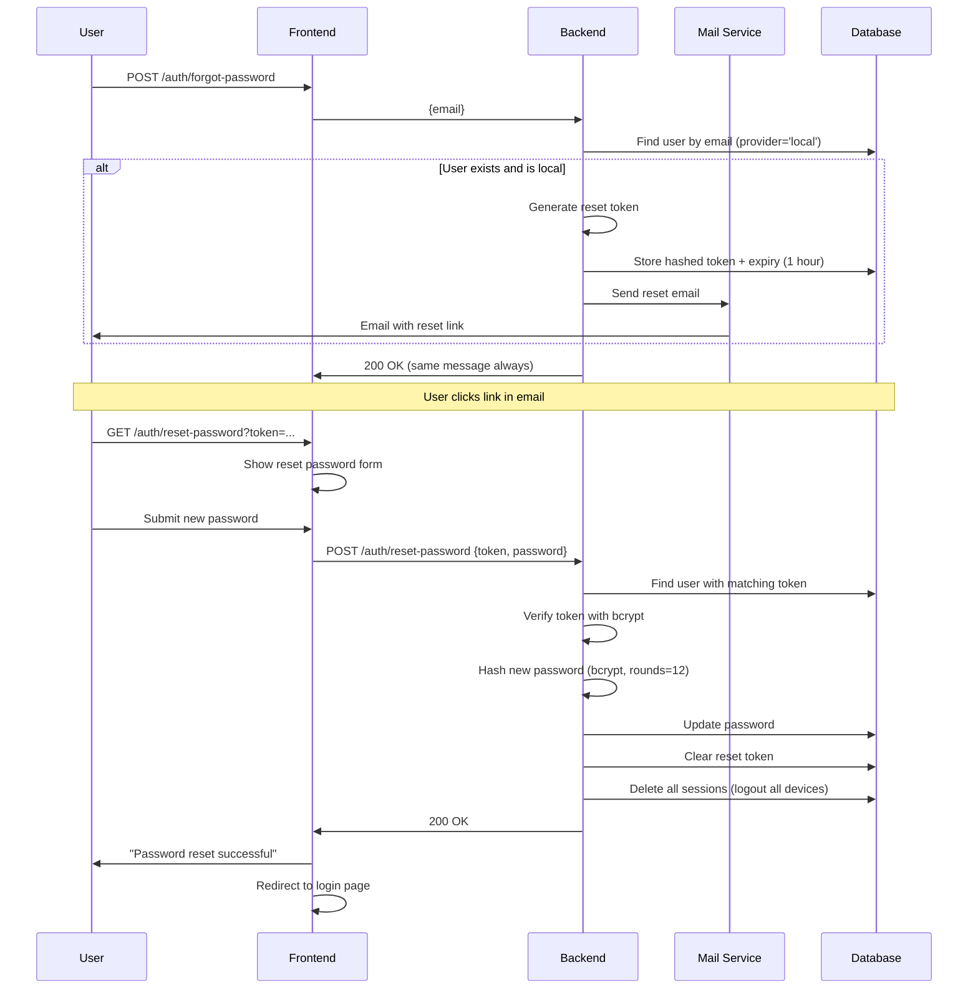

# Password Reset API Documentation

## Overview

API đặt lại mật khẩu cho người dùng quên mật khẩu. Chỉ áp dụng cho tài khoản local (provider = 'local').

**Base URL**: `/auth`

---

## Endpoints

### 1. Forgot Password (Quên mật khẩu)

Gửi email chứa link đặt lại mật khẩu. Endpoint này không tiết lộ thông tin về sự tồn tại của email (security best practice).

**Endpoint**: `POST /auth/forgot-password`

**Rate Limit**: 3 requests / 1 giờ

**Authentication**: Không yêu cầu (Public)

#### Request Body

```json
{
  "email": "user@example.com"
}
```

| Field | Type   | Required | Validation         | Description                |
| ----- | ------ | -------- | ------------------ | -------------------------- |
| email | string | Yes      | Valid email format | Email cần đặt lại mật khẩu |

#### Response

**Success (200 OK)**

```json
{
  "message": "If an account with that email exists, we sent a password reset link."
}
```

**Notes**:

- Response luôn giống nhau dù email có tồn tại hay không (security feature)
- Ngăn attacker dò tìm email đã đăng ký

**Error Responses**

- **429 Too Many Requests**: Vượt quá rate limit

```json
{
  "statusCode": 429,
  "message": "Too many requests",
  "error": "Too Many Requests"
}
```

#### cURL Example

```bash
curl -X POST http://localhost:3000/auth/forgot-password \
  -H "Content-Type: application/json" \
  -d '{
    "email": "user@example.com"
  }'
```

#### Notes

- Chỉ gửi email cho tài khoản local (provider = 'local')
- Tài khoản Google OAuth không thể đặt lại mật khẩu
- Token có hiệu lực 1 giờ (ngắn hơn email verification để tăng bảo mật)
- Nếu gửi email thất bại, log error nhưng vẫn trả về success message

---

### 2. Reset Password (Đặt lại mật khẩu)

Đặt lại mật khẩu mới sử dụng token từ email.

**Endpoint**: `POST /auth/reset-password`

**Rate Limit**: 5 requests / 1 giờ

**Authentication**: Không yêu cầu (Public)

#### Request Body

```json
{
  "token": "a1b2c3d4e5f6...",
  "password": "NewSecurePass123"
}
```

| Field    | Type   | Required | Validation           | Description    |
| -------- | ------ | -------- | -------------------- | -------------- |
| token    | string | Yes      | 64 hex characters    | Token từ email |
| password | string | Yes      | Minimum 8 characters | Mật khẩu mới   |

#### Response

**Success (200 OK)**

```json
{
  "message": "Password reset successful. Please log in with your new password."
}
```

**Error Responses**

- **400 Bad Request**: Token không hợp lệ hoặc hết hạn

```json
{
  "statusCode": 400,
  "message": "Invalid or expired reset token",
  "error": "Bad Request"
}
```

- **400 Bad Request**: Password validation failed

```json
{
  "statusCode": 400,
  "message": ["password must be longer than or equal to 8 characters"],
  "error": "Bad Request"
}
```

- **429 Too Many Requests**: Vượt quá rate limit

```json
{
  "statusCode": 429,
  "message": "Too many requests",
  "error": "Too Many Requests"
}
```

#### cURL Example

```bash
curl -X POST http://localhost:3000/auth/reset-password \
  -H "Content-Type: application/json" \
  -d '{
    "token": "YOUR_RESET_TOKEN",
    "password": "NewSecurePass123"
  }'
```

#### Notes

- Sau khi đặt lại mật khẩu thành công:
  - Password cũ bị thay thế bằng password mới (hash bcrypt, salt rounds = 12)
  - **Tất cả sessions hiện tại bị xóa** (security measure)
  - Token reset bị xóa khỏi database
  - User cần đăng nhập lại với mật khẩu mới

---

## Security Features

### Token Generation

```typescript
// Generate random 32-byte token (64 hex characters)
const resetToken = crypto.randomBytes(32).toString('hex');

// Hash token before storing in database
const hashedToken = await bcrypt.hash(resetToken, 10);
```

### Token Storage

- **Plain token**: Gửi qua email (1 lần duy nhất)
- **Hashed token**: Lưu trong database (field `passwordResetToken`)
- **Expiry**: 1 giờ từ thời điểm tạo (field `passwordResetTokenExpiry`)

### Password Hashing

- **Algorithm**: bcrypt
- **Salt Rounds**: 12 (high security)
- **Same as registration**: Đảm bảo consistency

### Session Invalidation

Sau khi đặt lại mật khẩu:

```typescript
// Invalidate all existing sessions
await prisma.session.deleteMany({
  where: { userId: matchedUserId },
});
```

**Rationale**: Ngăn attacker sử dụng sessions cũ nếu họ đã chiếm quyền truy cập

---

## Email Template

### Password Reset Email Content

Email được gửi từ `MailService`:

**Subject**: "Reset your password"

**Body** (HTML):

```html
<p>You requested to reset your password.</p>
<p>Click the link below to reset your password:</p>
<a href="{FRONTEND_URL}/auth/reset-password?token={TOKEN}">Reset Password</a>
<p>This link will expire in 1 hour.</p>
<p>If you didn't request this, please ignore this email.</p>
```

**Variables**:

- `{FRONTEND_URL}`: Từ environment variable
- `{TOKEN}`: Reset token 64 ký tự hex

---

## Integration Flow

### Password Reset Flow



---

## Frontend Integration

### Forgot Password Page

```typescript
'use client';

import { useState } from 'react';

export default function ForgotPasswordPage() {
  const [email, setEmail] = useState('');
  const [message, setMessage] = useState('');

  const handleSubmit = async (e: React.FormEvent) => {
    e.preventDefault();

    const response = await fetch('/auth/forgot-password', {
      method: 'POST',
      headers: { 'Content-Type': 'application/json' },
      body: JSON.stringify({ email })
    });

    const data = await response.json();
    setMessage(data.message);
  };

  return (
    <form onSubmit={handleSubmit}>
      <input
        type="email"
        value={email}
        onChange={(e) => setEmail(e.target.value)}
        placeholder="Enter your email"
        required
      />
      <button type="submit">Send Reset Link</button>
      {message && <p>{message}</p>}
    </form>
  );
}
```

### Reset Password Page

```typescript
'use client';

import { useState, useEffect } from 'react';
import { useRouter, useSearchParams } from 'next/navigation';

export default function ResetPasswordPage() {
  const router = useRouter();
  const searchParams = useSearchParams();
  const [password, setPassword] = useState('');
  const [confirmPassword, setConfirmPassword] = useState('');
  const [token, setToken] = useState('');

  useEffect(() => {
    const tokenParam = searchParams.get('token');
    if (tokenParam) {
      setToken(tokenParam);
    } else {
      // No token, redirect to forgot password
      router.push('/auth/forgot-password');
    }
  }, [searchParams, router]);

  const handleSubmit = async (e: React.FormEvent) => {
    e.preventDefault();

    if (password !== confirmPassword) {
      alert('Passwords do not match');
      return;
    }

    try {
      const response = await fetch('/auth/reset-password', {
        method: 'POST',
        headers: { 'Content-Type': 'application/json' },
        body: JSON.stringify({ token, password })
      });

      if (response.ok) {
        alert('Password reset successful!');
        router.push('/auth/login');
      } else {
        const error = await response.json();
        alert(error.message);
      }
    } catch (error) {
      console.error('Reset password error:', error);
    }
  };

  return (
    <form onSubmit={handleSubmit}>
      <input
        type="password"
        value={password}
        onChange={(e) => setPassword(e.target.value)}
        placeholder="New password"
        required
        minLength={8}
      />
      <input
        type="password"
        value={confirmPassword}
        onChange={(e) => setConfirmPassword(e.target.value)}
        placeholder="Confirm password"
        required
      />
      <button type="submit">Reset Password</button>
    </form>
  );
}
```

---

## Common Errors

### Token Expired

**Scenario**: User click link sau 1 giờ

**Response**:

```json
{
  "statusCode": 400,
  "message": "Invalid or expired reset token",
  "error": "Bad Request"
}
```

**Solution**: Yêu cầu gửi lại email reset bằng `/auth/forgot-password`

### OAuth Account

**Scenario**: User với Google account cố đặt lại mật khẩu

**Response**:

```json
{
  "message": "If an account with that email exists, we sent a password reset link."
}
```

**Note**: Không gửi email thực tế, nhưng response giống nhau

**Solution**: Thông báo user sử dụng Google login

### Password Too Weak

**Scenario**: Password < 8 ký tự

**Response**:

```json
{
  "statusCode": 400,
  "message": ["password must be longer than or equal to 8 characters"],
  "error": "Bad Request"
}
```

---

## Best Practices

### For Users

1. **Check spam folder**: Email có thể vào spam
2. **Act quickly**: Token chỉ có hiệu lực 1 giờ
3. **Use strong password**: Minimum 8 characters, mix of letters, numbers, symbols
4. **Re-login required**: Sau khi reset, phải đăng nhập lại trên tất cả thiết bị

### For Frontend Developers

1. **Email privacy**: Không hiển thị "Email không tồn tại" để bảo vệ privacy
2. **Token validation**: Kiểm tra token từ URL trước khi show form
3. **Password confirmation**: Yêu cầu nhập lại password để xác nhận
4. **Clear instructions**: Hướng dẫn user kiểm tra email và spam folder
5. **Expiry notice**: Thông báo token có hiệu lực 1 giờ

### For Backend Developers

1. **Rate limiting**: Ngăn brute force và spam
2. **Token expiry**: 1 giờ cho reset token (ngắn hơn verification)
3. **Session invalidation**: Xóa tất cả sessions sau khi reset
4. **Email error handling**: Log errors nhưng không fail request
5. **Provider check**: Chỉ gửi email cho local accounts

---

## Related APIs

- [Authentication](./authentication.md) - Đăng nhập sau khi reset password
- [Email Verification](./email-verification.md) - Tương tự token-based flow
- [Google OAuth](./google-oauth.md) - Alternative login method (không cần password)
